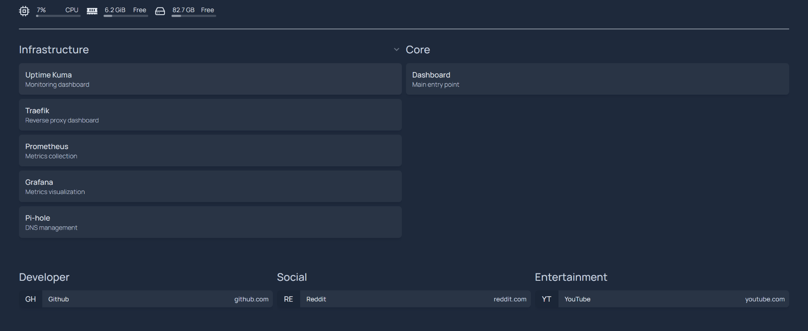
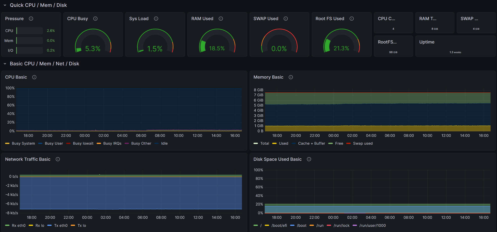
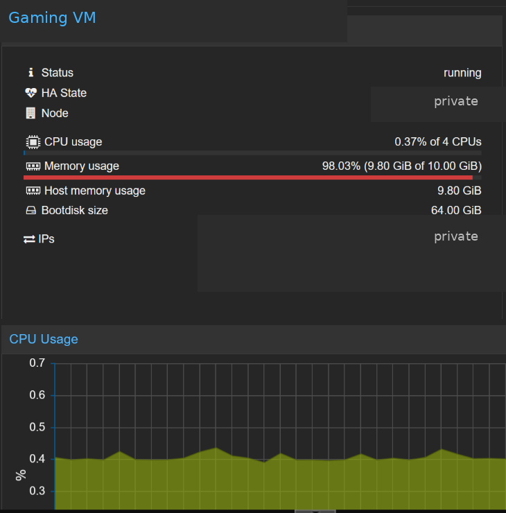
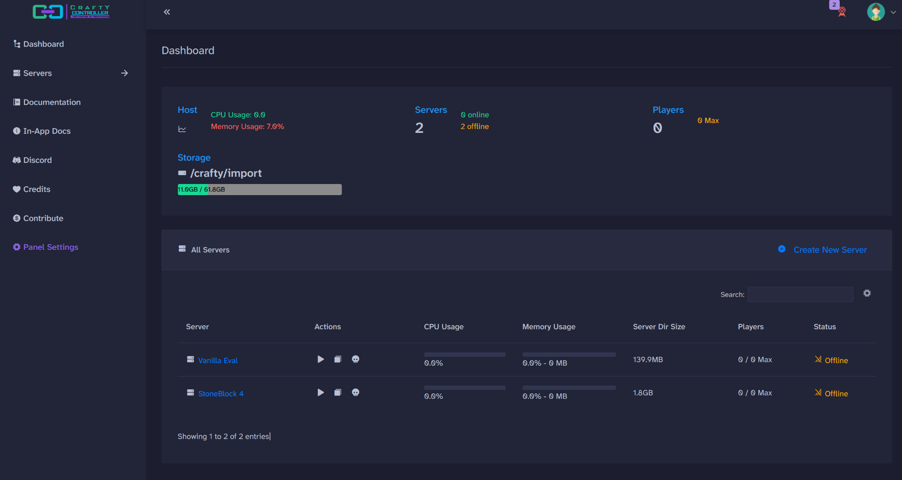

# Homelab

Personal homelab for self-hosting and systems work. I built most of it from
repurposed hardware while studying computer science, and I use it for private
services, monitoring, backups, Minecraft servers, and infrastructure
experiments.

> **Lab snapshot: September 2026.** Hardware and service details below describe
> the lab at that point in time.

## Lab at a glance

| System | Hardware / platform | Role |
| --- | --- | --- |
| **Core services** | Lenovo ThinkPad T430 · Ubuntu Server · ~8 GiB RAM | DNS, private ingress, monitoring, Vaultwarden, start page, backups |
| **Virtualization host** | Ryzen 5 2600 · 16 GiB DDR4 · Proxmox VE · SATA SSD + NVMe | VMs/LXCs, gaming infrastructure, application experiments |
| **Gaming VM** | Debian 12 · Docker · 4 vCPU · 10 GiB RAM | Crafty Controller, Minecraft workloads, game ingress |
| **Admin / development** | ASUS ROG Zephyrus G14 (2024) · Windows 11 + WSL | SSH administration, development, maintenance, local experiments |

More detail: [hardware and roles](docs/hardware.md).

## Architecture

```text
                         HOMELAB

                    Tailscale private access
                             │
                ┌────────────┴─────────────┐
                │                          │
          ThinkPad T430               Proxmox host
          Ubuntu Server               Ryzen 5 2600
                │                          │
          Docker services                VMs / LXCs
                │                          │
     ┌──────────┼──────────┐          Gaming VM
     │          │          │               │
  Pi-hole    Traefik   Observability     Crafty
                         │                 │
                 Prometheus / Grafana   Minecraft
                    Loki / Kuma            │
                                          Playit

                Backup / recovery
                     │
               Restic + B2
```

The T430 carries the lightweight services I want available most of the time.
The Proxmox host carries VMs, game servers, and experiments that need more
resources or stronger isolation.

[Architecture details](docs/architecture.md)

## Services

- **Networking and access:** Tailscale, Pi-hole, Traefik
- **Observability:** Prometheus, node exporter, Grafana, Loki, Alloy, Uptime Kuma
- **Core services:** Vaultwarden, Homepage, supporting Docker services
- **Backup:** Restic with local and encrypted Backblaze B2 copies, plus scheduled
  Proxmox VM backups
- **Gaming:** Crafty Controller, Minecraft, Playit

[Full service map](docs/services.md)

## Screenshots

### Services and monitoring

<p align="center">
  
  
</p>

### Virtualization and gaming

<p align="center">
  
  
</p>

*The Proxmox screenshot is sanitized to remove private host and address details.*

## Selected engineering work

### SSH hardening and configuration precedence

A new OpenSSH drop-in specified `PasswordAuthentication no`, while the effective
configuration still reported password authentication enabled. An earlier
cloud-init fragment was taking precedence. I moved the owner policy earlier in
the drop-in order, validated the daemon configuration, confirmed a fresh
key-only login, and confirmed a fresh password login failed.

### Backup and restore testing

The core-services host uses Restic for local and encrypted B2 backups. I have
restored the Vaultwarden database from both paths and checked SQLite integrity on
the restored copy. The Proxmox host also keeps scheduled VM backups for the
gaming VM.

### External exposure testing

For a September 2026 check, I disconnected Tailscale and tested selected
SSH/DNS/HTTP/HTTPS ports from a cellular network. The tested IPv4 paths did not
reach the lab. IPv6 remained unresolved because the external client did not have
a working IPv6 route.

### On-demand game workloads

A modded StoneBlock server accounted for most of the gaming VM's memory use while
it was running. Stopping the server returned the VM to a low idle footprint, so
large game servers stay on demand.

[Operations and reliability](docs/operations.md)

## Gaming

Minecraft is one of the main workloads on the virtualization host. Crafty
Controller runs inside a dedicated Debian VM, administration stays on Tailscale,
and Playit handles player-facing game traffic.

[Gaming infrastructure](docs/gaming.md)

## Next

Current areas I want to explore:

- a more personalized Homelab Home;
- Ansible for repeatable host configuration and validation;
- local model serving on existing hardware;
- a future gaming/GPU machine for Sunshine/Moonlight and local inference;
- personal media and storage when capacity requirements justify it;
- a disposable Kubernetes/GitOps lab; and
- side projects such as the Aiden TV CRT channel network.

## Documentation

- [Hardware & roles](docs/hardware.md)
- [Architecture](docs/architecture.md)
- [Services](docs/services.md)
- [Operations & reliability](docs/operations.md)
- [Gaming infrastructure](docs/gaming.md)
- [Selected changes & snapshots](docs/history/)

The public repo omits credentials, private addresses, internal DNS names, exact
management endpoints, and sensitive recovery details. Dated snapshots provide
historical context; live systems determine current state.
